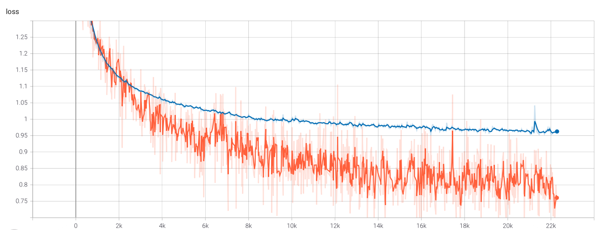

# Melody generator with RNNs 

The goal of this project is to learn how to apply machine learning techniques to produce music. In this project I'll being training Google Magenta's Melody RNN model from scratch using songs in symbolic representation "midi" of Pop and Electronic songs. Midi describes the music using a notation containing the musical notes and timing, but not the sound or timbre of the actual sound. 

# About the Data

In this project I'll use the ["The Lakh MIDI Dataset v0.1"](https://colinraffel.com/projects/lmd/) and matched content from ["The Million Song Dataset."](millionsongdataset.com)

I'll fetch a song's genre using the [Last.fm API](www.last.fm/api/)

* LMD-matched - A subset of 45,129 files from LMD-full which have been matched to entries in the Million Song Dataset.

* Match scores - A json file which lists the match confidence score for every match in LMD-matched and LMD-aligned.

* Dataset not provided in this repo

## Data Visualization

* Instrument Class of the entire dataset

* Distribution of Piano lengths of Pop and Electronic Songs

## Class count for Pop and Electronic

# Training Magenta's Melody RNN models

* Melody RNN (basic configuration)
    - This configuration acts as a baseline for melody generation with an LSTM model. It uses basic one-hot encoding to represent extracted melodies as input to the LSTM. For training, all sequence examples are transposed to the MIDI pitch range [48,84] and outputs will also be in this range.

* Melody RNN (attention configuration)
    - Attention allows the model to more easily access past information without having to store that information in the RNN cell's state. This allows the model to more easily learn longer term dependencies, and results in melodies that have longer arching themes. 

## Training and evaluation data

* Melody RNN Baseline (Loss)

* Baseline RNN (Accuracy)

* Melody RNN w/ Attention config (Loss)

* Melody RNN w/ Attention config (Accuracy)

