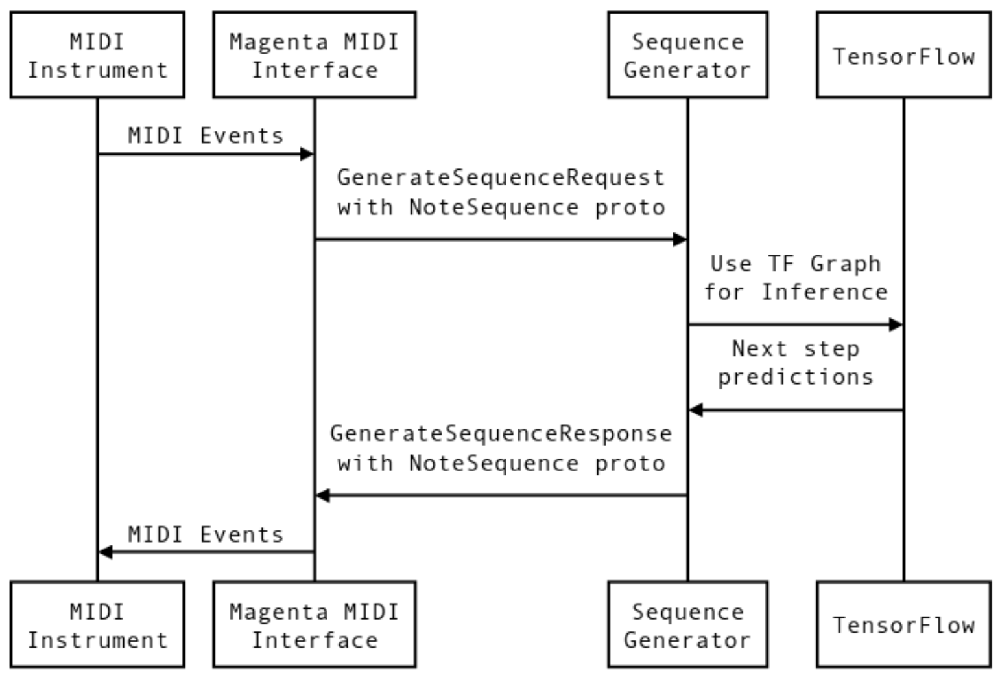
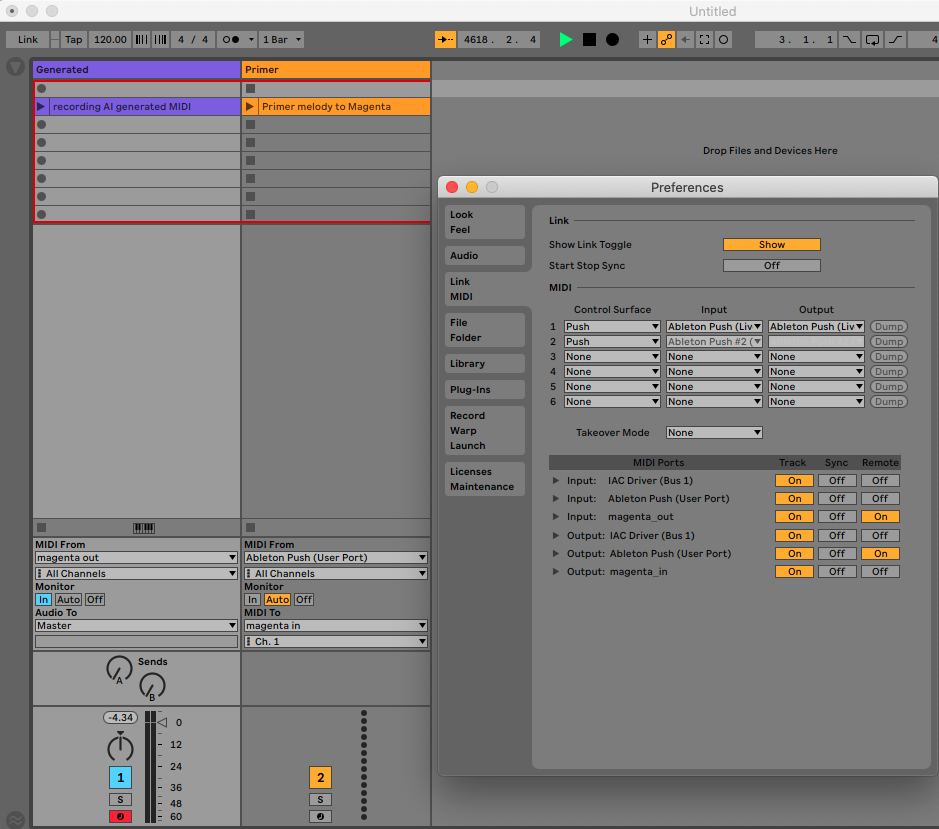
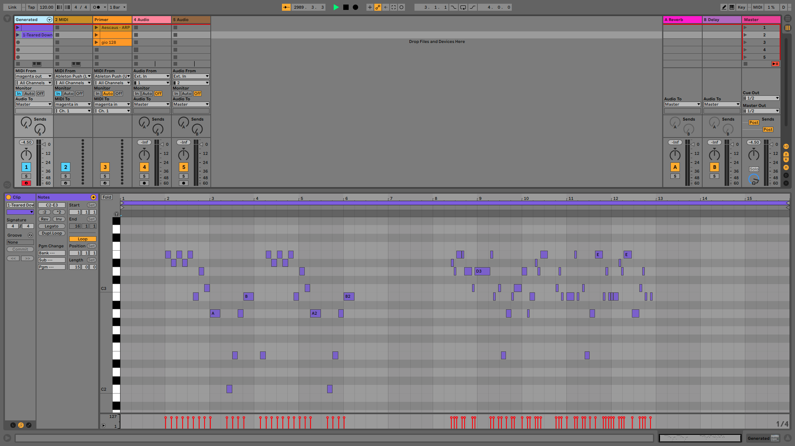

# Overview of Magenta.js web application and Making Magenta interact with Ableton Live

<hr>

Here I used the checkpoint converter to convert the trained "baseline RNN model" for magenta.js. I've used a simple template that has a fixed "original melody" button and a generated button to continue the sequence given to the trained baseline model.

* In the converted base directory you'll find the files generated from the converter. The config file will be called upon when I open the index.html.

``` bash 
python -m http.server

# this command below should be in a seperate terminal window
open index.html
```

<hr>


<hr>

# How to send MIDI from Magenta to DAW "Ableton Live"
* I find generating melodies more useful in a DAW "digital audio workstation" Ableton where you can audition and record everything a lot easier.


* Below shows the signal flow of MIDI from the instrument thur the interface where the MIDI is converted to NoteSequence proto. The model used must have a Sequence Generator attribute to interact with the MIDI Interface. Here I used the trained Melody RNN w/ attention config. The prediction is made and the response is routed back through "magenta_out" of Magneta MIDI Interface.



## Start generating 

* make sure the the attention_rnn.mag file is in the current directory to be called upon. These files are in the saved_model_bundles dir.

```bash
conda activate magenta

magenta_midi \
--input_port="IAC Driver Bus 1" \ # out of Ableton and input Magenta MIDI
--output_port="magenta_out" \ # out Magenta MIDI and input into Ableton
--bundle_files=attention_rnn.mag \ # bundle of my trained model
--enable_metronome=false \ # metronome on or off
--qpm=128  # control the bpm
```

## Ableton IO configuration

* In the image below pay close attention to the in and outs on both the preferences page and on the actual MIDI channels in session view. 

* The primer channel "Orange" can either be MIDI file that you play or MIDI controller where I can play a melody myself. Once the MIDI file is done playing Magenta will take a bar of silence and return a response "generated MIDI" that I can then record. "setup in channel 1"



## Generated Melody from primer "MIDI track" on channel 2

* audio engineer rule of thumb "record everything!"

* Here you can see in the first six bars is the primer melody from the MIDI file. The bars of silence is waiting for Magenta to return an AI generated melody. Have fun!


