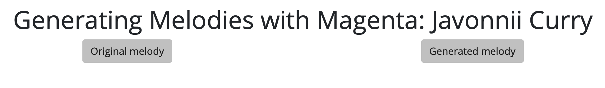

# Overview of Magenta.js web application and Making Magenta interact with Ableton Live

<hr>

Here I'll use the checkpoint converter to convert the trained "baseline RNN model" for magenta.js. I've used a simple template that has a fixed "original melody" button and a generated button to continue the sequence given to the trained baseline model.

* In the converted base directory you'll find the files generated from the converter. The config file will be called upon when I open the index.html.

``` bash 
python -m http.server

open index.html
```

<hr>


